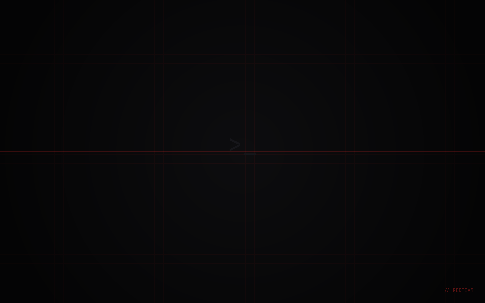

# dotfiles

> CachyOS (Arch) · KDE Plasma / Wayland · fish · ghostty · strict monochrome (black / white / gray)



A full desktop rice built around one idea: **strict blackout monochrome — black,
white, gray, nothing else.** Zero color from GRUB to the browser chrome. True
black `#060608` (OLED pixels off), a light-gray accent `#d0d0d8`, graphite
surfaces. One coherent look everywhere: bootloader, login screen, Plasma,
terminals, editor, browser.

`accent` reasserts the whole **MonoBlack** palette across KDE + fish + terminals
in one command.

## What's inside

| Path        | What                                                                                     |
| ----------- | ---------------------------------------------------------------------------------------- |
| `fish/`     | fish config: starship, zoxide, fzf, abbreviations that expand in place                   |
| `starship/` | prompt — git status, language versions, command duration                                 |
| `ghostty/`  | terminal: monochrome palette, JetBrainsMono, sane keybinds                               |
| `git/`      | gitconfig (aliases, delta, zdiff3) + global ignore — identity is a placeholder           |
| `vscode/`   | settings, keybindings, snippets, extension list — grayscale syntax                       |
| `theme/`    | `MonoBlack` KDE color scheme, konsole, alacritty, GTK, icons, wallpapers, `accent`       |
| `kde/`      | Plasma Look-and-Feel `MonoBlack` (Breeze decoration) + kdeglobals/kwinrc/kcminputrc/…    |
| `system/`   | **GRUB** + **SDDM** MonoBlack themes (QML) + root deploy script                          |
| `zen/`      | Zen Browser: hardened `user.js`, monochrome `userChrome.css`, `policies.json`            |
| `misc/`     | btop theme, fastfetch config, vesktop (Discord) theme                                    |

## Install

```bash
git clone https://github.com/charlz-ferra/dotfiles ~/dotfiles
cd ~/dotfiles
./install.sh        # backs up everything it touches, timestamped
```

Dependencies:

```bash
sudo pacman -S --needed fish starship zoxide fzf git-delta eza bat fd ripgrep github-cli
sudo pacman -S --needed ttf-jetbrains-mono-nerd ttf-meslo-nerd   # Nerd Fonts for icons
```

GRUB/SDDM themes need root and are deployed separately:

```bash
sudo ./system/deploy-system.sh
```

Apply-commands that aren't files (colorscheme, konsole default, KWin bits)
live in [`theme/NOTES.md`](theme/NOTES.md).

## Sync back

`./sync.sh` pulls the current system configs into the repo. It deliberately
skips `~/.gitconfig` and `kscreenlockerrc` — both carry identity or absolute
paths. Review the diff before committing; the last line of the script greps
for the usual leaks.

## License

MIT — take the theme, leave the paranoia. Or take both.
